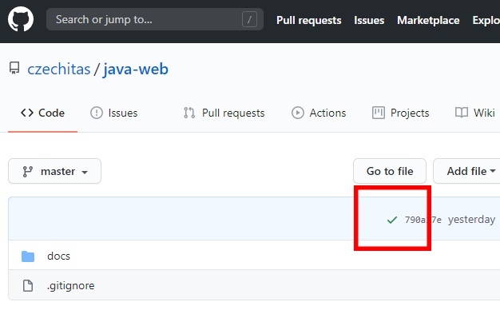

Web pro studenty kurzů Java v Czechitas
=======================================

Toto je gitová repository hostující zdrojové texty webu <https://java.czechitas.cz/>.
Jde o statický web generovaný z `html`, `md` a `scss` ve složce `/docs`
pomocí generátoru Jekyll (napsaného v Ruby) s gemem GitHub Pages.
Website je automaticky nasazována a vystavena pomocí GitHub Pages při každém
`git commit & push` do repository na adrese <https://java.czechitas.cz/>.

Použití
-------

Stačí `git commit & push` do repository a continuous integration v GitHub Pages web automaticky přenasadí.
Trvá to zhruba 10-30 sekund.

**Poznámka:**
Na stránce v GitHubu je vidět, jestli se build a nasazení webu povedlo ✔ nebo selhalo ❌.
K logům Jekyllu se bohužel nijak dostat nedá. Ty můžete vidět jen, když si Jekyll rozchodíte lokálně.

Založení nového jednodenního/jednorázového kurzu
------------------------------------------------

Jakýkoliv soubor vložený do složky `/docs` bude automaticky 1:1 přístupný na webu.
Výjimkou jsou soubory ve speciálních složkách `_posts`, `_includes` a dalších začínající `_`,
které ale v jednodenních akcích asi nevyužijete.

1.  Přidejte tedy složkovou strukturu vašeho kurzu:

    Například pro `/2020-podzim/java-uvod-2`:
    ~~~~
    /
    |
    +-- 2020-podzim
        |
        +-- java-uvod-2
            |
            +-- index.html
            +-- prezentace.pdf
    ~~~~

2. Přidejte dlaždici do rozcestníku na výchozí stránce `/index.html`.

Založení nového dlouhodobého kurzu
----------------------------------

Dlouhodobé kurzy typicky používají mechaniku *blogových* příspěvků, kterou poskytuje Jekyll.
Jde o složku `_posts` se soubory `md`. Např. `/2020-jaro/java-2/_posts`.
Založení je tedy mírně komplikovanější:

1.  Přidejte konfiguraci pro vyhledávání `_posts` do souboru `/_config.yml`:

    Například pro `/2020-podzim/java-1-praha`:
    ~~~~
    defaults:
      # ...
      # předchozí obsah
      # ...
      - scope:
          path: "2020-podzim/java-1-praha"
          type: "posts"
        values:
          layout: default-post
      # ...
      # další obsah
      # ...
    ~~~~

2.  Přidejte složkovou strukturu vašeho kurzu:

    Například pro `/2020-podzim/java-1-praha`:
    ~~~~
    /
    |
    +-- 2020-podzim
        |
        +-- java-1-praha
            |
            +-- _posts
            |   |
            |   +-- 2020-09-15-uvod.md
            |   +-- 2020-09-16-lekce01.md
            |
            +-- img
            |   |
            |   +-- ukol01-bublanina-fotka.jpg
            |
            +-- index.html
    ~~~~

3.  Přidejte `_includes`, které budete používat na každé stránce kurzu
    (odkazuje se na ně `/_layouts/default_post.html`):

    Například pro `/2020-podzim/java-1-praha`:
    ~~~~
    /
    |
    +-- 2020-podzim
        |
        +-- java-1-praha
            |
            +-- _includes
                |
                +-- menu.html
                +-- breadcrumb.html
    ~~~~

4. Přidejte dlaždici do rozcestníku na výchozí stránce `/index.html`.

Zprovoznění lokální verze pro pokusy
------------------------------------

Přidání příspěvku je bez problému možné udělat *pushem* přímo do "produkce",
ale pro složitější pokusy je výrazně lepší si rozběhnout Jekyll lokálně na počítači,
abyste nepřetěžovali CI GitHubu anebo nerozbili živé webové stránky na <https://java.czechitas.cz/>.

### Postup:

1.  Nainstalujte Ruby with DevKit (je to nejběžnější distribuce).

    Pro Windows: https://jekyllrb.com/docs/installation/windows/

    Po instalaci vyzkoušejte, že máte `ruby` a `gem` v `PATH` a že to funguje:
    ~~~~
    C:\> ruby --version

    > ruby 2.6.6p146 (2020-03-31 revision 67876) [x64-mingw32]
    ~~~~

    Pokud ne, přidejte si je tam.

2.  Nainstalujte Bundler (obdoba Mavenu).

    ~~~~
    C:\> gem install bundler
    ~~~~

    **Poznámka:** Příkaz lze zadat z kterékoliv složky na disku. Nic se v ní vytvářet nebude, ani se v ní nebude hledat žádný soubor.

    Více info: <https://docs.github.com/en/enterprise/2.14/user/articles/setting-up-your-github-pages-site-locally-with-jekyll#requirements>

3.  Nainstalujte **Jekyll** gem pomocí Bundleru.
    Proveďte to ze složky `/docs` v repository našeho webu.
    Je v ní totiž `Gemfile` (obdoba `pom.xml` z Mavenu). Bundler si stáhne nejnovější verzi gemu **GitHub Pages**
    a všechny jeho požadované závislosti (**Jekyll** gem a další).

    ~~~~
    C:\github--czechitas--java-web\docs> bundle install
    ~~~~

    Více info: <https://docs.github.com/en/enterprise/2.14/user/articles/setting-up-your-github-pages-site-locally-with-jekyll#step-2-install-jekyll-using-bundler>

4.  Spusťte Jekyll na pozadí a můžete začít provádět změny ve zdrojových souborech.

    ~~~~
    C:\github--czechitas--java-web\docs> bundle exec jekyll serve  --incremental

    > Configuration file: C:/github--czechitas--java-web/docs/_config.yml
    >             Source: C:/github--czechitas--java-web/docs
    >        Destination: C:/github--czechitas--java-web/docs/_site
    >     Server address: http://127.0.0.1:4000
    >   Server running... press ctrl-c to stop.
    ~~~~

    Web je vystavený na <http://localhost:4000/>

    Více info: <https://docs.github.com/en/enterprise/2.14/user/articles/setting-up-your-github-pages-site-locally-with-jekyll#step-4-build-your-local-jekyll-site>

GitHub Pages a Jekyll obecně
----------------------------

*  Kompletní vygenerovaný web je ve složce `/docs/_site`.

*  Výchozí theme je `Primer` (<https://github.com/pages-themes/primer>).

   Vypadá takhle: <https://pages-themes.github.io/primer/>.

*  Themes lze změnit v `_config.yml` z podporovaných existujících themes (<https://pages.github.com/themes/>):
   ~~~~
   theme: THEME-NAME
   ~~~~
   Více info o themes:
   <https://docs.github.com/en/github/working-with-github-pages/adding-a-theme-to-your-github-pages-site-using-jekyll>

*  Lze si vytvořit vlastní theme, ale je to celkem dost práce a je třeba ho zároveň publikovat jako gem.
   Vlastní theme lze nastavit v `_config.yml`:
   ~~~~
   remote-theme: REPOSITORY/THEME-NAME
   ~~~~
   Více info: <https://github.blog/2017-11-29-use-any-theme-with-github-pages/>

*  Jednodušší je přizpůsobit existující theme.

   Jakýkoliv soubor, který explicitně nadefinujete ve stejném umístění
   a se stejným jménem, jako původní soubor z theme, překryje ten původní z theme.

   Pár tipů k přizpůsobování výchozího `Primer`u:
   <https://docs.github.com/en/github/working-with-github-pages/adding-a-theme-to-your-github-pages-site-using-jekyll#customizing-your-themes-css>

*  Alternativně lze výchozí theme úplně vypnout v `_config.yml`:
   ~~~~
   theme: THEME-NAME
   ~~~~
